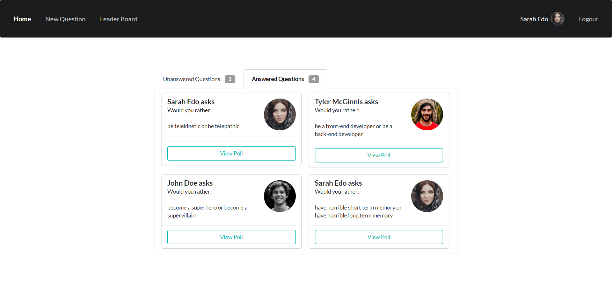
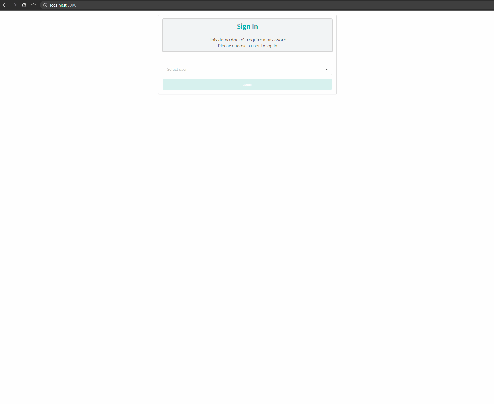
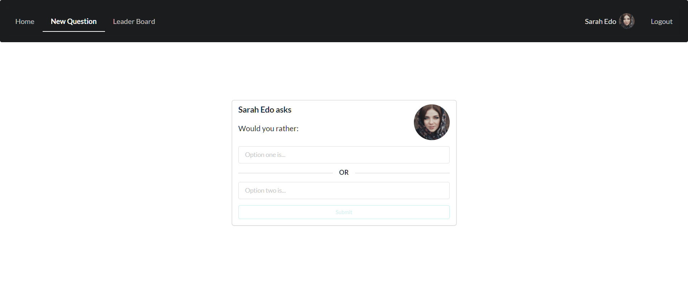
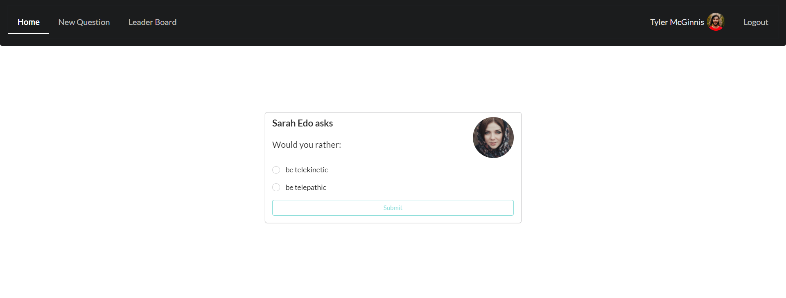
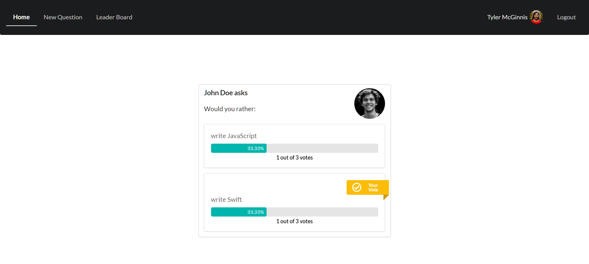
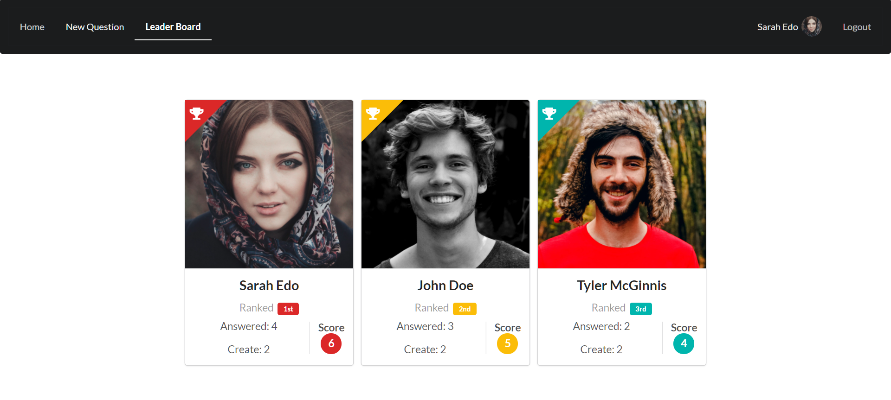

# Would You Rather

Would You Rather is polling game that presents the user with a series of questions.

built with React, Redux, React Router, & Redux Thunk.



---

## Installation

```bash
$ git clone https://github.com/Ahmedashref26/would-you-rather.git
$ cd would-you-rather
$ npm install
```

---

## Usage

The project can be run with

- `npm start`

---

## Data

The `_DATA.js` file represents a fake database and methods that let you access the data.

There are two types of objects stored in our database:

- Users
- Questions

### Users

Users include:

| Attribute | Type   | Description                                                                                                                                                                                                    |
| --------- | ------ | -------------------------------------------------------------------------------------------------------------------------------------------------------------------------------------------------------------- |
| id        | String | The user’s unique identifier                                                                                                                                                                                   |
| name      | String | The user’s first name and last name                                                                                                                                                                            |
| avatarURL | String | The path to the image file                                                                                                                                                                                     |
| questions | Array  | A list of ids of the polling questions this user created                                                                                                                                                       |
| answers   | Object | The object's keys are the ids of each question this user answered. The value of each key is the answer the user selected. It can be either `'optionOne'` or `'optionTwo'` since each question has two options. |

### Questions

Questions include:

| Attribute | Type   | Description                            |
| --------- | ------ | -------------------------------------- |
| id        | String | The question’s unique identifier       |
| author    | String | The author’s unique identifier         |
| timestamp | String | The time when the question was created |
| optionOne | Object | The first voting option                |
| optionTwo | Object | The second voting option               |

### Voting Options

Voting options are attached to questions. They include:

| Attribute | Type   | Description                                                        |
| --------- | ------ | ------------------------------------------------------------------ |
| votes     | Array  | A list that contains the id of each user who voted for that option |
| text      | String | The text of the option                                             |

Your code will talk to the database via 4 methods:

- `_getUsers()`
- `_getQuestions()`
- `_saveQuestion(question)`
- `_saveQuestionAnswer(object)`

1. `_getUsers()` Method

_Description_: Get all of the existing users from the database.  
_Return Value_: Object where the key is the user’s id and the value is the user object.

2. `_getQuestions()` Method

_Description_: Get all of the existing questions from the database.  
_Return Value_: Object where the key is the question’s id and the value is the question object.

3. `_saveQuestion(question)` Method

_Description_: Save the polling question in the database.  
_Parameters_: Object that includes the following properties: `author`, `optionOneText`, and `optionTwoText`. More details about these properties:

| Attribute     | Type   | Description                                |
| ------------- | ------ | ------------------------------------------ |
| author        | String | The id of the user who posted the question |
| optionOneText | String | The text of the first option               |
| optionTwoText | String | The text of the second option              |

_Return Value_: An object that has the following properties: `id`, `author`, `optionOne`, `optionTwo`, `timestamp`. More details about these properties:

| Attribute | Type   | Description                                                                                                                  |
| --------- | ------ | ---------------------------------------------------------------------------------------------------------------------------- |
| id        | String | The id of the question that was posted                                                                                       |
| author    | String | The id of the user who posted the question                                                                                   |
| optionOne | Object | The object has a text property and a votes property, which stores an array of the ids of the users who voted for that option |
| optionTwo | Object | The object has a text property and a votes property, which stores an array of the ids of the users who voted for that option |
| timestamp | String | The time when the question was created                                                                                       |

4. `_saveQuestionAnswer(object)` Method

_Description_: Save the answer to a particular polling question in the database.
_Parameters_: Object that contains the following properties: `authedUser`, `qid`, and `answer`. More details about these properties:

| Attribute  | Type   | Description                                                                             |
| ---------- | ------ | --------------------------------------------------------------------------------------- |
| authedUser | String | The id of the user who answered the question                                            |
| qid        | String | The id of the question that was answered                                                |
| answer     | String | The option the user selected. The value should be either `"optionOne"` or `"optionTwo"` |

---

## Screenshots








